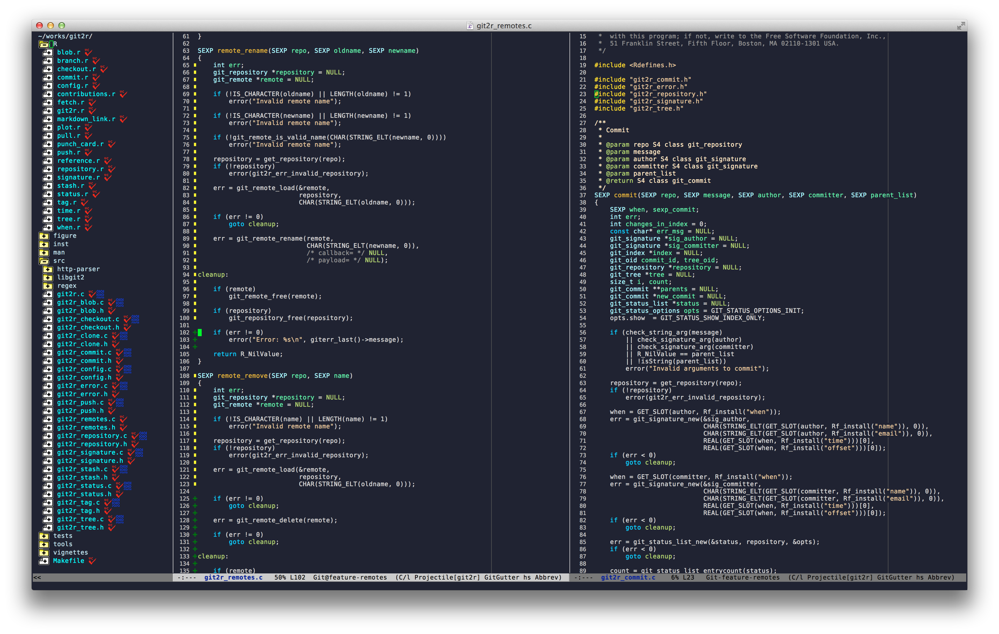

# Emacs configuration file for programming, mostly in R and C/C++

## Features

- Dark theme.
- Bare look to minimize clutter on screen, no menu bar, no toolbar,
  no scrollbars.
- Line numbers on left margin.
- Thin vertical line at column 75.
- Save/load history.
- Markdown mode.
- Speedbar in the same frame.
- DejaVu Sans Mono font (needs to be installed).
- OSX `fn` and `command` key support.
- Code folding.
- Open a file from anywhere in the current git repository.
- Mark git changes on the left margin.
- Maximize frame on startup

